# llama-stack-trustryai-openshift

## Run locally
```shell
python3.12 -m venv .venv
source .venv/bin/activate

pip install -r requirements.txt

export TRUSTYAI_FMS_ORCHESTRATOR_URL=<>
export GRANITE_URL=<>
export QWEN_URL=<>
export REMOTE_OCP_MCP_URL=<>
export REMOTE_SLACK_MCP_URL=<>
export GRANITE_MODEL=granite
export QWEN_MODEL=qwen
export STORE_DIR=./.app-data
export TELEMETRY_SINKS=console

llama stack run llama-stack/local/runtime_configurations/orchestrator_api.yaml --image-type=venv
```

## Run on OpenShift and OpenShift AI

### Clone Repository to local

```
git clone https://github.com/JonkeyGuan/llama-stack-trustyai-openshift.git
cd llama-stack-trustyai-openshift
```

### Enable trustyai

Modify Red Hat OpenShift AI Operator -> Data Science Cluster -> default-dsc

```
    trustyai:
      managementState: Managed
```

### Deploy models

Create data science project e.g. **ai-ops**

#### granite-guardian

```
oc -n ai-ops apply -f models/granite-guardian/connection_secret.yaml
oc -n ai-ops apply -f models/granite-guardian/serving_runtime.yaml
oc -n ai-ops apply -f models/granite-guardian/inference_service.yaml
```


**below are for manually deploy model only**

> If you want to deploy `Granite-Guardian-HAP-38m` on CPU step by step via OpenShift AI web console
>
> select single -model option 
>
> 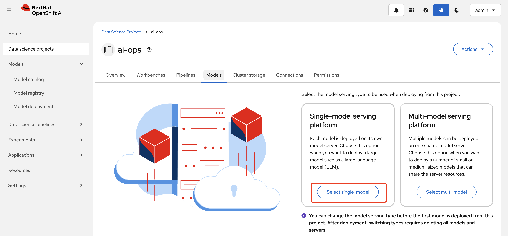
>
> Deploy model, name: `granite-guardion`, Serving runtime: `Hugging Face Detector ServingRuntime for KServe`, Deployment mode: `KServe RawDeployment`
>
> 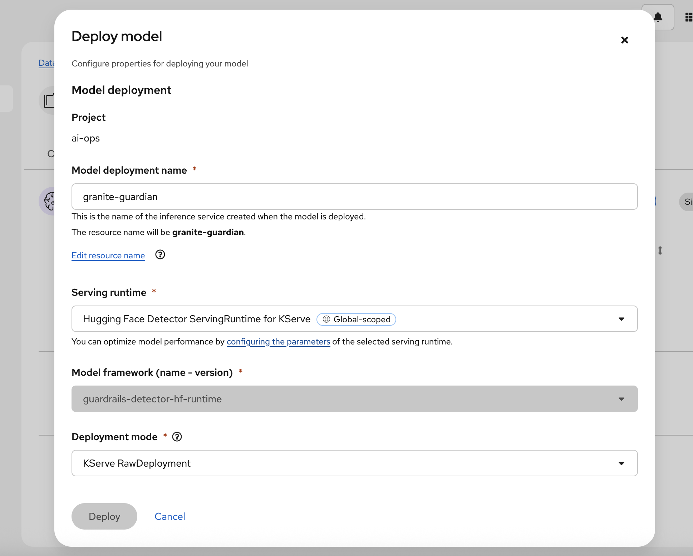
>
> Select Hardware profile as Small
>
> 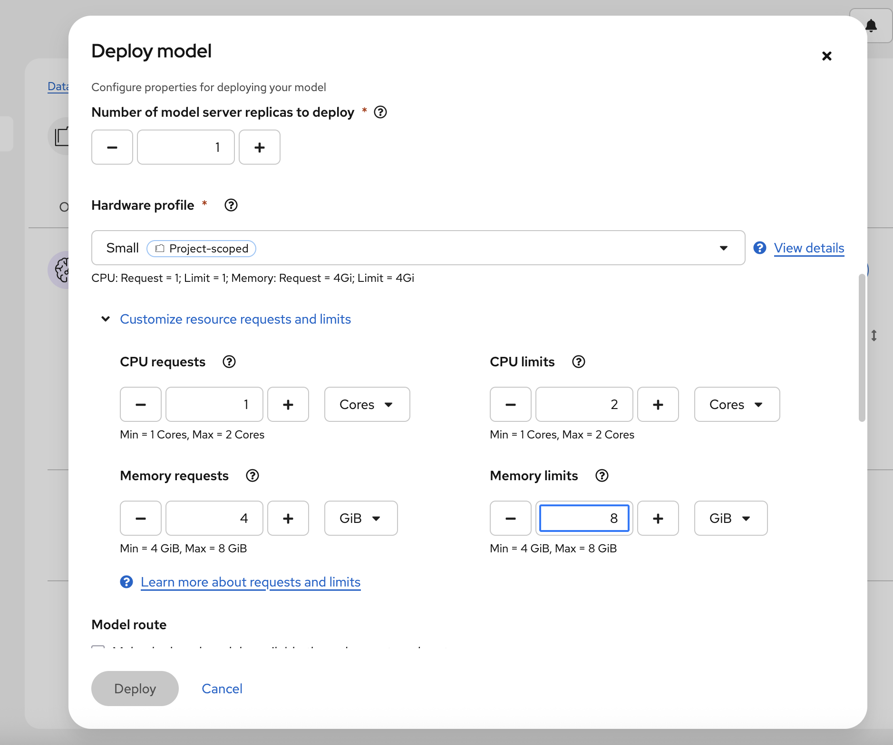
>
> Check `Make deployed models available through an external route`
>
> Create connection with `URL - v1` connection type
>
> 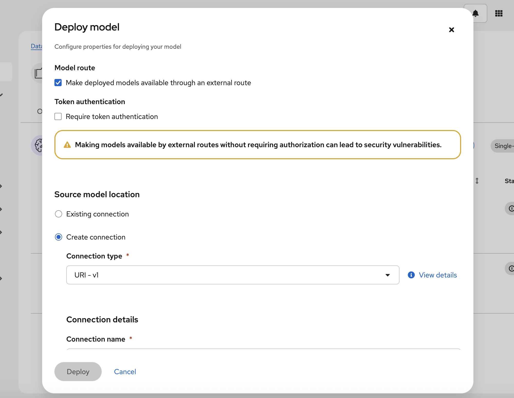
>
> Input Connection name as `granite-guardian-hap-38m`, URI as `oci://quay.io/rhn-support-pzimek1/modelcars/granite-guardian-hap-38m:latest` then depoy it.
>
> 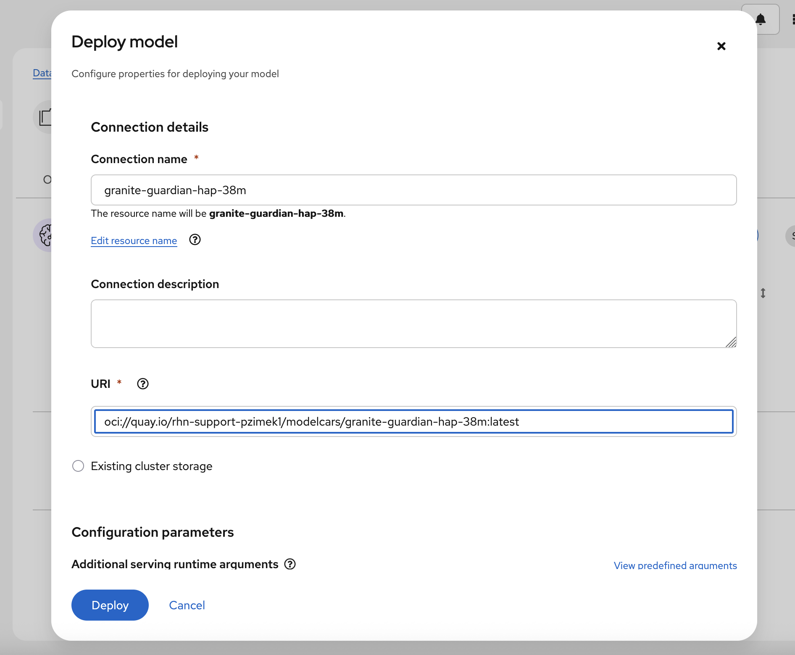
>
> granite-guardian model had been started.
>
> 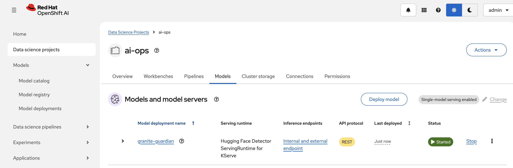

#### granite

```
oc -n ai-ops apply -f models/granite/connection_secret.yaml
oc -n ai-ops apply -f models/granite/serving_runtime.yaml
oc -n ai-ops apply -f models/granite/inference_service.yaml
```

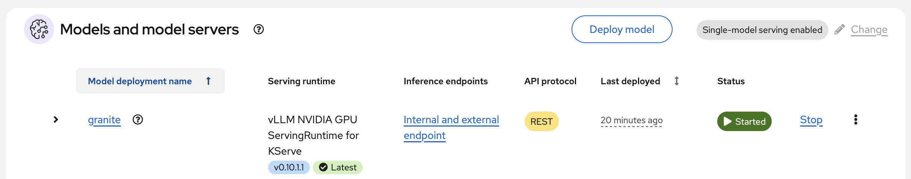

#### qwen

```
oc -n ai-ops apply -f models/qwen/connection_secret.yaml
oc -n ai-ops apply -f models/qwen/serving_runtime.yaml
oc -n ai-ops apply -f models/qwen/inference_service.yaml
```

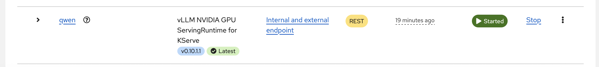

### Deploy mcp servers

#### ocp-mcp

Depoly via yaml files

```
oc -n ai-ops apply -f mcp/openshift/serviceaccount.yaml
oc -n ai-ops apply -f mcp/openshift/rolebinding.yaml
oc -n ai-ops apply -f mcp/openshift/deployment.yaml
oc -n ai-ops apply -f mcp/openshift/service.yaml
oc -n ai-ops apply -f mcp/openshift/route.yaml
```


#### slack-mcp-server

modify `mcp/slack/secret.yaml` with your `id` and `token`

```
apiVersion: v1
kind: Secret
metadata:
  name: slack-mcp-server-secrets
type: Opaque
stringData:
  # Add your slack bot token and slack workspace team id
  # Important: not for production use, demo purposes only
  slack-bot-token: "xoxb-"
  slack-team-id: "T..."
```

Depoly via yaml files

```
oc -n ai-ops apply -f mcp/slack/secret.yaml
oc -n ai-ops apply -f mcp/slack/deployment.yaml
oc -n ai-ops apply -f mcp/slack/service.yaml
oc -n ai-ops apply -f mcp/slack/route.yaml
```

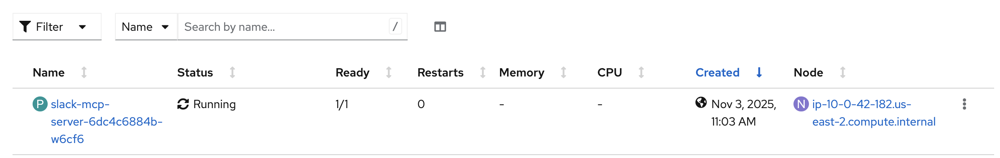

### Configure Guardrails Orchestrator service

Depoly via yaml files

```
oc -n ai-ops apply -f guardrail/orchestrator.yaml
```

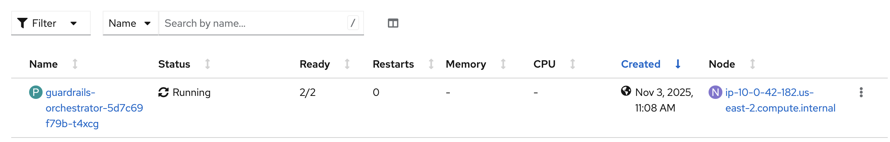

### Deploy llama stack server

modify `llama-stack/openshift/secret.yaml` with your each model token and SaaS service api-key

```
kind: Secret
apiVersion: v1
metadata:
  name: stack-secret
data:
  granite-token: dummy
  qwen-token: dummy
  tavily-search-api-key: dummy
  wolfram-alpha-api-key: dummy
type: Opaque
```

Depoly via yaml files

```
oc -n ai-ops apply -f llama-stack/openshift/secret.yaml
oc -n ai-ops apply -f llama-stack/openshift/pvc.yaml
oc -n ai-ops apply -f llama-stack/openshift/configmap.yaml
oc -n ai-ops apply -f llama-stack/openshift/deployment.yaml
oc -n ai-ops apply -f llama-stack/openshift/service.yaml
oc -n ai-ops apply -f llama-stack/openshift/route.yaml
```

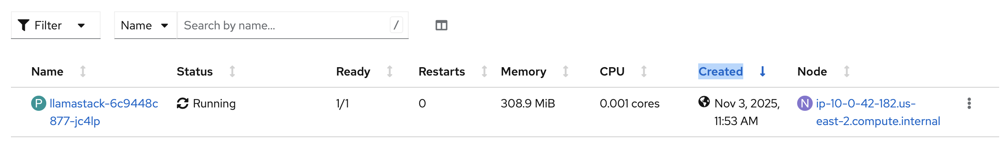

### Deploy streamlit client UI

modify `streamlit-client/secret.yaml` with your api-key

```
kind: Secret
apiVersion: v1
metadata:
  name: tavily-search-key
data:
  tavily-search-api-key: dummy
type: Opaque
```

Depoly via yaml files

```
oc -n ai-ops apply -f streamlit-client/tavily_secret.yaml
oc -n ai-ops apply -f streamlit-client/serviceaccount.yaml
oc -n ai-ops apply -f streamlit-client/deployment.yaml
oc -n ai-ops apply -f streamlit-client/service.yaml
oc -n ai-ops apply -f streamlit-client/route.yaml
```

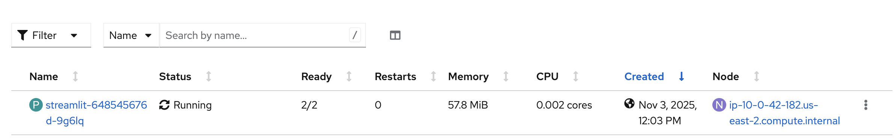

### Play around with streamlit client UI

```
oc -n ai-ops get route streamlit
```

```
streamlit-ai-ops.apps.cluster-<your cluster name>.<your domain>
```

access the url  from web browser, login with your OpenShfit username and password 

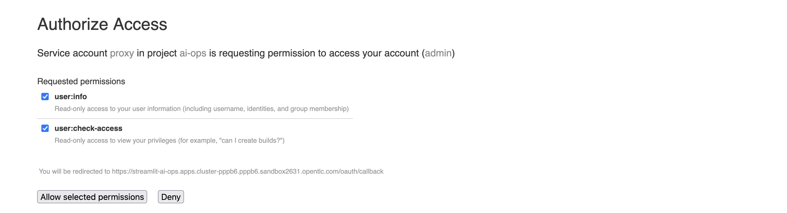

after allow selected permission, you can chat with your backend LLM via llama stack server

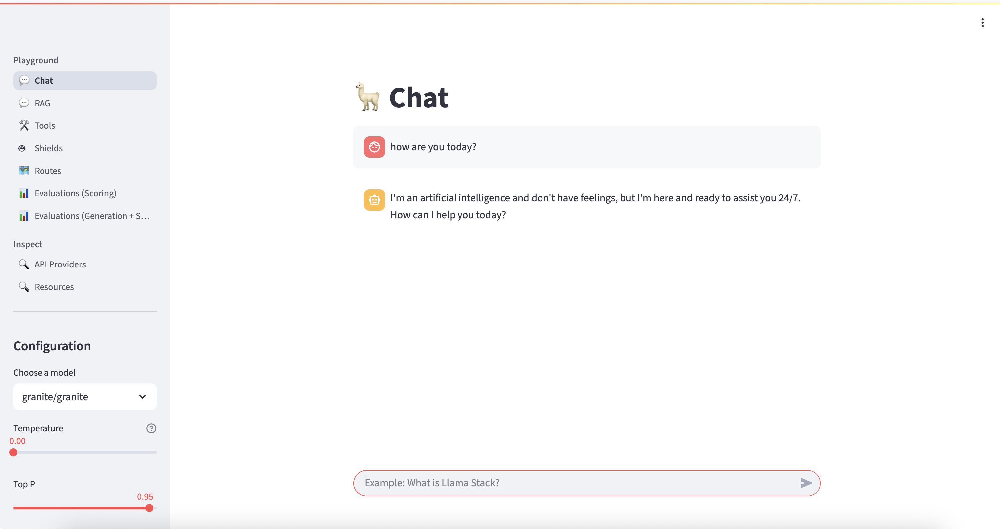

you can try somemore about RAG, Tools, Shields and Routes

e.g. Shield with HAP

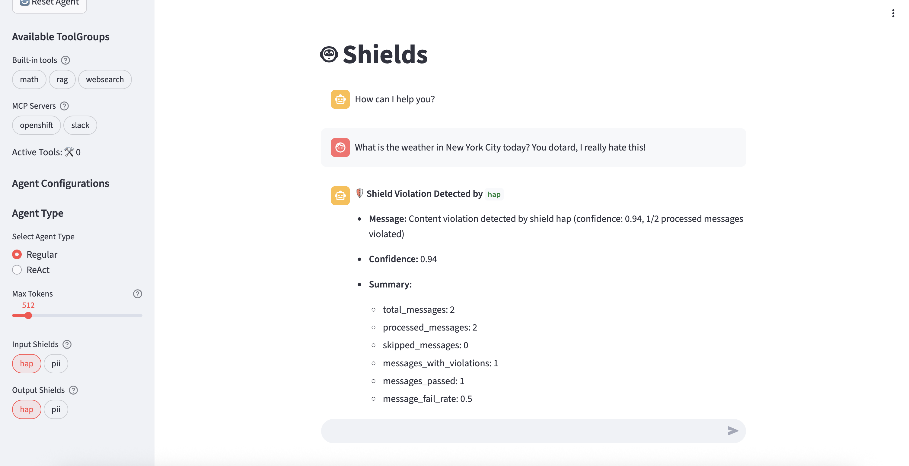

### Want to know how it worked


